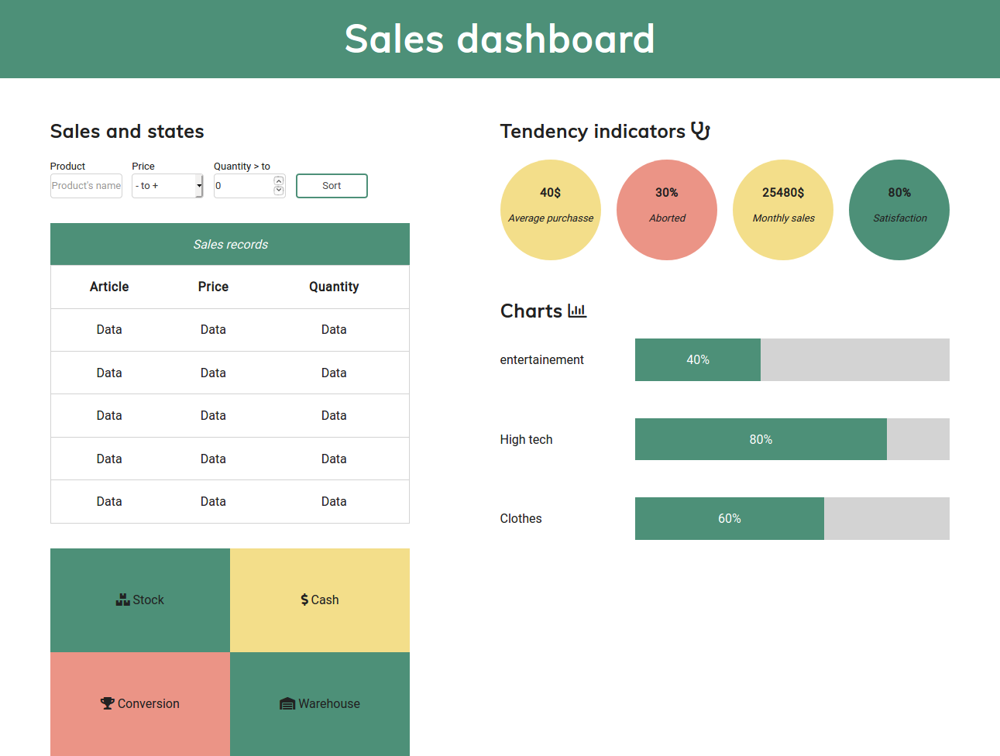

# Dashboard pour la gestion de données

Il s'agit d'un projet produit dans le cadre de mon poste en tant que formateur en développement web. Ce projet a pour but de permettre aux étudiants de mettre en oeuvre les concepts en HTML et CSS qu'ils viennent de découvrir et ainsi d'apprendre à produire des interfaces graphiques pour le web. A ce stade de la formation les interfaces ne sont pas encore responsives.

Au travers de cet exercice, ils apprennent à :
- Utiliser une base boilerplate
- Positionner des éléments grâce à flexbox
- Réaliser des formulaires HTML
- Réaliser des tableaux HTML
- Réaliser des mises en forme complexes
- Gérer les couleurs
- Intégrer des librairies à leurs projets
- Optimiser le CSS avec DRY
- Mettre en place des classes utilitaires

## Consignes

Intégrateur dans une société d'analyse de données, l'équipe a pensé à une nouvelle manière de présenter les données. Après concertation une nouvelle version du tableau de bord pour la gestion des données a été conçue. Le graphiste de l'entreprise a produit une maquette que voici :

Votre rôle est d'utiliser vos compétences en HTML et CSS pour reproduire le plus fidèlement possible la maquette qui vous a été donnée.

Spécifications techniques :
- HTML5
- CSS3
- Positionnement avec flexbox
- Mise en place du principe DRY
- Google fonts pour les polices
- Font awesome pour les icônes
